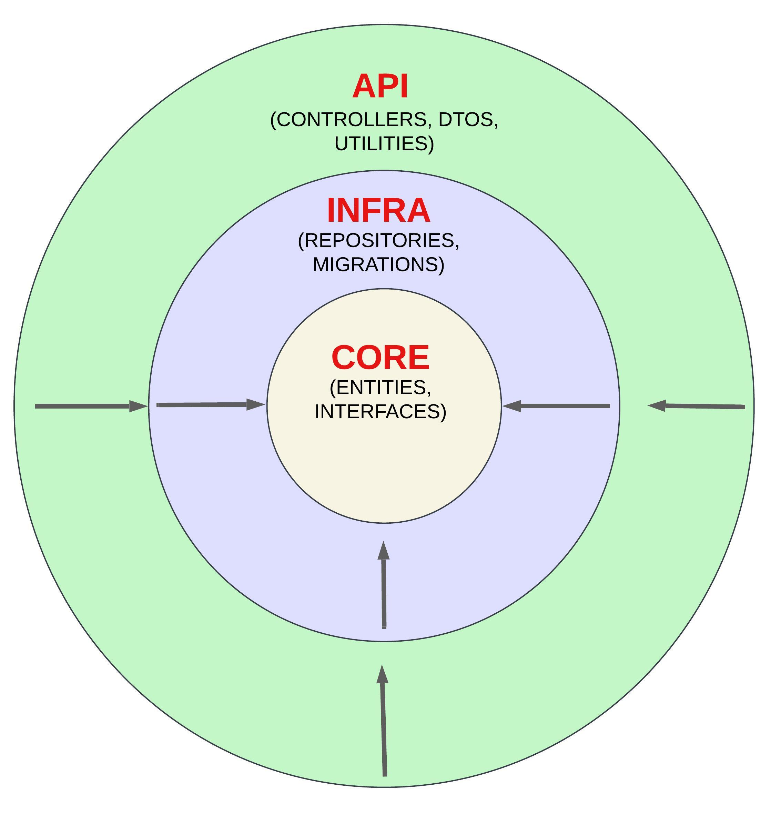
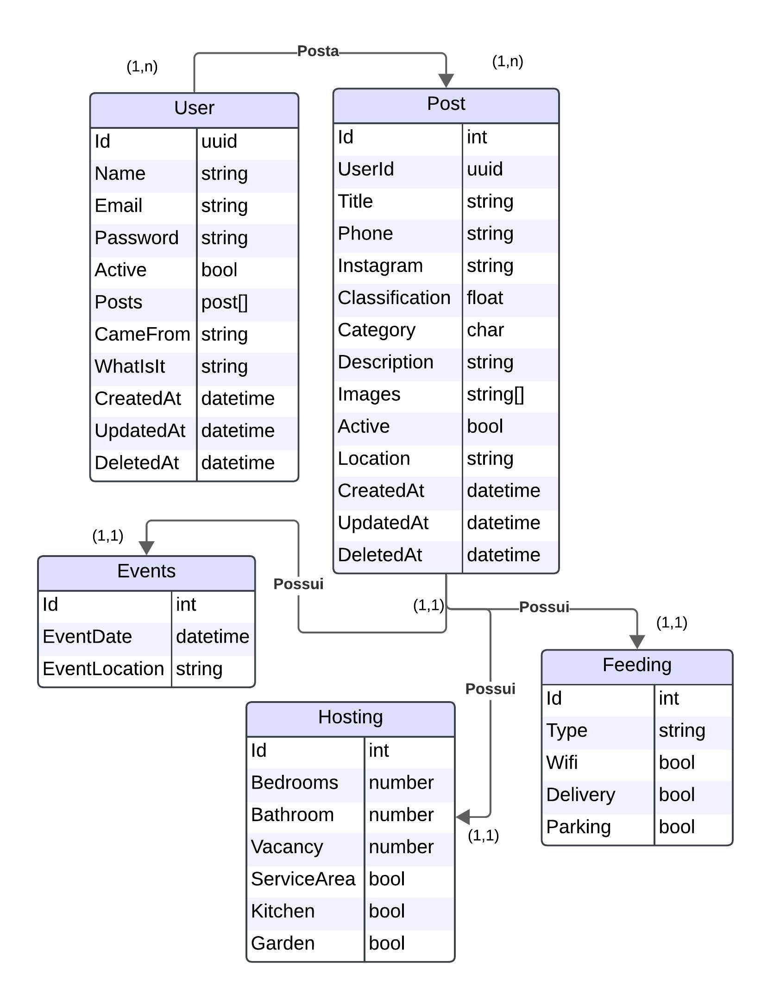

# PortalMartins
Desenvolvimento de uma Plataforma Integrada de Informações Locais para Fomentar o Turismo e a Economia

1. [Projeto](#projeto)
- 1.1 [Requisitos]
- 1.2 [Implementação]
- 1.3 [Imagens]
2. [API]
- 1.1 [User]
- 1.2 [Hosting]
- 1.3 [Feeding]
- 1.4 [Event]
- 1.5 [Image]

### [ODS](https://brasil.un.org/pt-br/sdgs)
 - Trabalho decente e crescimento econômico
 - Cidades e comunidades sustentáveis

## Setor de Aplicação
O projeto será aplicado na cidade de Martins - RN e região, beneficiando os moradores. O setor de aplicação inclui informações sobre restaurantes, imóveis para venda/aluguel e eventos locais

## Objetivos
- **Facilitar o acesso a informações locais**: Desenvolver uma plataforma intuitiva que permita aos usuários encontrar informações sobre restaurantes, casas para alugar/vender e eventos na cidade.

- **Promover a colaboração com a comunidade**: Incentivar proprietários de estabelecimentos e moradores a compartilhar informações relevantes, como seus estabelecimentos e detalhes sobre eventos locais.

## Projeto

### Requisitos
#### 1. Requisitos Funcionais

|    |        Título        |                                       Descrição                                        |
| :--: | :------------------: | :------------------------------------------------------------------------------------: |
| RF01 | Cadastro de Usuários | Permitir que moradores e proprietários de estabelecimentos criem contas na plataforma. |
| RF02 | Publicação de Posts  |   Funcionalidade para usuários cadastrarem seus restaurantes, hospedagens ou eventos   |
| RF03 |  Listagem de Posts   |                        Páginas separadas para cada tipo de post                        |
| RF04 |      Avaliação       |            Permitir que usuários avaliem posts por classificação (estrelas)            |
| RF05 |    Gerenciamento     |   Área para que os usuários possam gerenciar seus posts (criar, atualizar, deletar)    |

#### 2. Requisitos Não Funcionais

|     |     Título     |                                                                               Descrição                                                                                |
| :---: | :------------: | :--------------------------------------------------------------------------------------------------------------------------------------------------------------------: |
| RNF01 |  Usabilidade   |                                          Plataforma deve ser intuitiva e de fácil navegação para usuários de todas as idades                                           |
| RNF02 |   Mobilidade   |                                        Design responsivo para acesso em diferentes dispositivos (desktop, tablets, smartphones)                                        |
| RNF03 |   Desempenho   |               O sistema deve suportar um grande número de usuários simultâneos, garantindo que as consultas e atualizações sejam realizadas rapidamente                |
| RNF04 |   Segurança    |                              Implementar medidas de segurança para proteção dos dados dos usuários e das informações dos estabelecimentos                              |
| RNF05 | Gerenciamento  |                                           Área para que os usuários possam gerenciar seus posts (criar, atualizar, deletar)                                            |
| RNF06 | Acessibilidade | Garantir que a plataforma esteja em conformidade com as diretrizes de acessibilidade, permitindo que pessoas com deficiências possam utilizar todas as funcionalidades |

### Implementação

|      Área      |         Ferramenta          |
| :------------: | :-------------------------: |
|   Front-End    |           Angular           |
|    Back-End    |             C#              |
| Banco de dados | PostgreSQL/MYSQL ou MongoDB |
|     Cache      |            Redis            |

### Imagens

{ width=450 }
{ width=450 }

---

## API

### USER

#### /users 
response(
    string Name,
    string CameFrom,
    string WhatIsIt,
    DateTime CreatedAt,
    DateTime UpdatedAt
)

#### /create
request(
    string Name, 
    string Email,
    string Password,
    string? CameFrom, 
    string? WhatIsIt
) => body

#### /login
request(
	string Email,
	string Password
) => body

response(
    string Name, 
    string Email, 
    string Token, 
    DateTime CreatedAt
)

#### /update/user
request(
	string Name, 
	string Email, 
	string Password
) => body

#### /delete/user
request(
	string Password
) => body

---

### HOSTING

#### /get/hostings
response(
    int Id,
    string Title,
    string Location,
    string Phone,
    string Instagram,
    float Classification,
    string Description,
    string[] Images,
    int Bedrooms,
    int Bathroom,
    int Vacancy,
    bool ServiceArea,
    bool Kitchen,
    bool Garden,
    DateTime CreatedAt,
    DateTime UpdatedAt
)

#### /create/user/hosting
request(
    string Title,
    string Location,
    string? Phone,
    string? Instagram,
    string? Description,
    int Bedrooms,
    int Bathroom,
    int Vacancy,
    bool ServiceArea,
    bool Kitchen,
    bool Garden
)

#### /get/user/hostings
response(
    int Id,
    string Title,
    string Location,
    string Phone,
    string Instagram,
    float Classification,
    string Description,
    string[] Images,
    int Bedrooms,
    int Bathroom,
    int Vacancy,
    bool ServiceArea,
    bool Kitchen,
    bool Garden,
    DateTime CreatedAt,
    DateTime UpdatedAt
)

#### /update/user/hosting
request(
    int Id,
    string? Title,
    string? Location,
    string? Phone,
    string? Instagram,
    string? Description,
    int? Bedrooms,
    int? Bathroom,
    int? Vacancy,
    bool? ServiceArea,
    bool? Kitchen,
    bool? Garden
)

#### /delete/user/hosting/{id}

---

### FEEDING

#### /get/feedings
response(
    int Id,
    string Title,
    string Location,
    string Phone,
    string Instagram,
    float Classification,
    string Description,
    string[] Images,
    string Type,
    bool Wifi,
    bool Delivery,
    bool Parking,
    DateTime CreatedAt,
    DateTime UpdatedAt
)

#### /create/user/feeding
request(
    string Title,
    string Location,
    string? Phone,
    string? Instagram,
    string? Description,
    string Type,
    bool Wifi,
    bool Delivery,
    bool Parking
)

#### /get/user/feedings
response(
    int Id,
    string Title,
    string Location,
    string Phone,
    string Instagram,
    float Classification,
    string Description,
    string[] Images,
    string Type,
    bool Wifi,
    bool Delivery,
    bool Parking,
    DateTime CreatedAt,
    DateTime UpdatedAt
)

#### /update/user/feeding
request(
    int Id,
    string? Title,
    string? Location,
    string? Phone,
    string? Instagram,
    string? Description,
    string? Type,
    bool? Wifi,
    bool? Delivery,
    bool? Parking
)

#### /delete/user/feeding/{id}

---

### EVENT

#### /get/events
response(
    int Id,
    string Title,
    string Location,
    string Phone,
    string Instagram,
    float  Classification,
    string Description,
    string[] Images,
    DateTime EventDate,
    string EventLocation,
    DateTime CreatedAt,
    DateTime UpdatedAt
)

#### /create/user/event
request(
    string Title,
    string Location,
    string? Phone,
    string? Instagram,
    string? Description,
    DateTime? EventDate,
    string? EventLocation
)

#### /get/user/events
response(
    int Id,
    string Title,
    string Location,
    string Phone,
    string Instagram,
    float  Classification,
    string Description,
    string[] Images,
    DateTime EventDate,
    string EventLocation,
    DateTime CreatedAt,
    DateTime UpdatedAt
)

#### /update/user/event
request(
    int Id,
    string? Title,
    string? Location,
    string? Phone,
    string? Instagram,
    string? Description,
    DateTime? EventDate,
    string? EventLocation
)

#### /delete/user/event/{id}

---

### IMAGE

#### /upload/user/image
request(
    IFormFile File, 
    int Id
)

#### /delete/user/image
request(
    int Id,
    string Path
)
